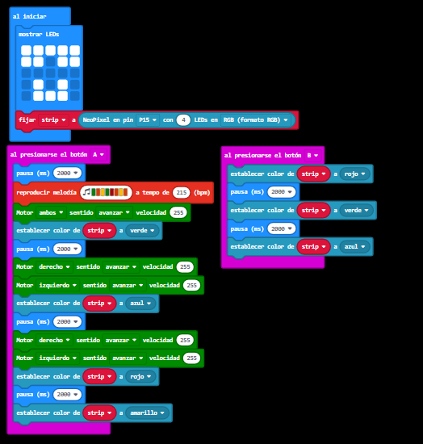

# Programación Básica
## Ejemplo 1
En este ejercicio se programa la microbit para que al encenderse muestre una cara sonriente y luego un corazón latiendo. Tambien se programará para que al pulsar el boton A o B se enciendo el led izquierdo o derecho y se reproduzca un efecto de sonido, al presionar A y B a la vez sonara una alarma, y a pulsar el logotipo, una melodia.

-[Enlace al programa](microbit-maqueen2.hex)

-[Enlace al video de la Mcqueen reproduciendo el programa](https://www.youtube.com/shorts/29INlVmVf9U)

## Ejemplo 2
Aqui dividiremos el ejercicio en tres ejemplos, que consistiran en el uso de los motores, la modificación de la velocidad y la dirección, y el control de RGB
con la extensión neopixel. (solo es necesario hacer uno)

### Ejemplo 2.3: Motores y led's.
En este ejercicio programaremos la mcqueen para que al pulsar el boton A avance a maxima velocidad mientras enciende los leds RGB, despues de reproducir una melodia.
cuando pulse el botón B, se encenderan los leds en otros colores.

-[Enlace al programa](microbit-motores-y-leds.hex)

-[Enlace al video de la Mcqueen reproduciendo el programa](https://www.youtube.com/watch?v=Pjtv0cjMd7I)
