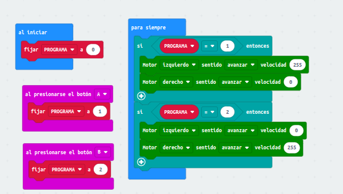
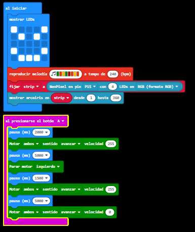

# Programación basica 2: variables y bucles de control
## Ejemplo 3: Almacenar variables, los datos y sensores
En esta tare programaremos la microbit para que use los sensores de temperatura y nos la muestre en la pantalla led.

- [codigo microbit](microbit-modificarvariable.hex)

- [video funcionamiento]()

## Ejemplo adicional
El robot debe avanzar en linea recta 5 segundos, a continuación, dara una vuelta de 180º y volvera al punto de inicio.

- [codigo microbit](microbit-ejemplo-adicional.hex)

- [video funcionamiento](https://www.youtube.com/watch?v=3IOH6qUYyAM)
