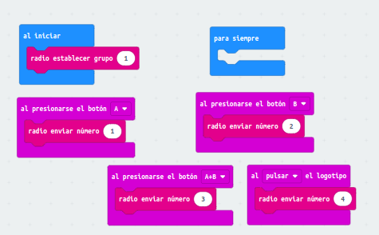
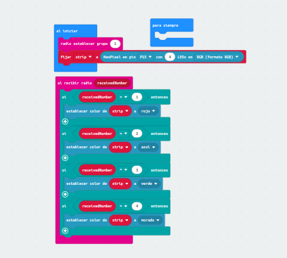
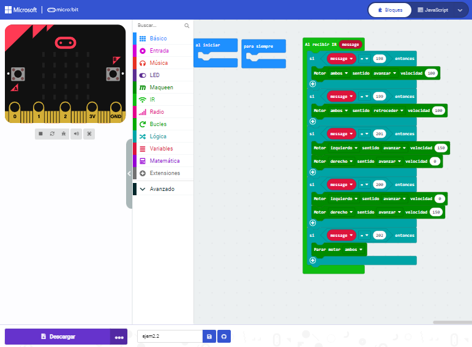

## Control por radio y mando IR
# Ejemplo 1: control del robot utilizando otro microbit
En este ejercicio tienes que configurar una placa de microbit que sea el que controlará al maqueen, y lo que hara la microbit es a traves de los botones se cambien de color los leds del maqueen

- [Codigo microbit](microbit-modulo_ampliacion_video4.hex)
- [Codigo microbit](microbit-modulo_ampliacion_video4_ejemplo2.hex)
- [enlace video](https://youtube.com/shorts/KYnD0uvBFBE?feature=share)

# Ejemplo 2: Control del robot a través de un mando
Primero tenemos que realizar un pequeño codigo, el cual necesitaremos para saber que numero da cada boton que pulsemos.
Dichos numeros tendremos que anotarlos.

 
 - [CÓDIGO](microbit-ejem21.hex)

Una vez realizado el apartado anterior, realizaremos un nuevo programa, el cual controlará los motores para que el robot haga lo que nosotros queramos. 
En este caso es:

- Tecla UP - Num 198 - `IR HACIA DELANTE`
- Tecla DOWN - Num 199 - `IR HACIA ATRAS`
- Tecla LEFT - Num 200 - `GIRAR HACIA LA IZQUIERDA`
- Tecla RIGHT - Num 201 - `GIRAR HACIA LA DERECHA`
- Tecla ENTER - Num 202 - `PARAR`

- [CÓDIGO](microbit-ejem22.hex)
- [VÍDEO]()
