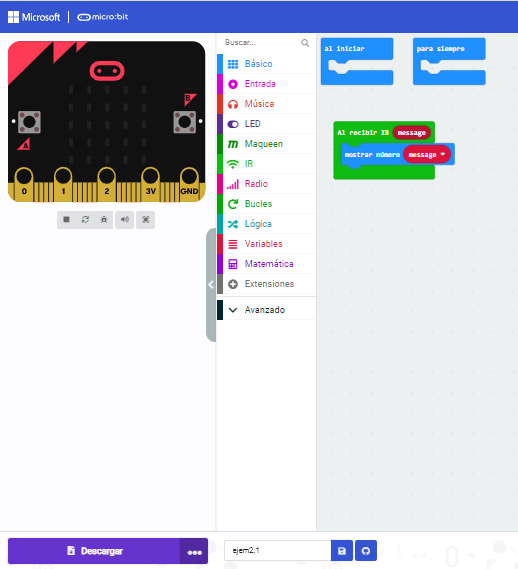

## Control por radio y mando IR
# Ejemplo 1: control del robot utilizando otro microbit
En este ejercicio tienes que controlar los leds de maqueen a traves de una placa de microbit aparte, es decir cuando presione un boton u otro se cambie de color.

- [Codigo microbit](microbit-modulo_ampliacion_video4.hex)
- [Codigo microbit](microbit-modulo_ampliacion_video4_ejemplo2.hex)
- [enlace video](https://youtube.com/shorts/KYnD0uvBFBE?feature=share)

# Ejemplo 2: Control del robot a través de un mando
Primero tenemos que realizar un pequeño codigo, el cual necesitaremos para saber que numero da cada boton que pulsemos.
Dichos numeros tendremos que anotarlos.

 
 - [CÓDIGO](microbit-ejem21.hex)

Una vez realizado el apartado anterior, realizaremos un nuevo programa, el cual controlará los motores para que el robot haga lo que nosotros queramos. 
En este caso es:

- Tecla UP - Num 198 - `IR HACIA DELANTE`
- Tecla DOWN - Num 199 - `IR HACIA ATRAS`
- Tecla LEFT - Num 200 - `GIRAR HACIA LA IZQUIERDA`
- Tecla RIGHT - Num 201 - `GIRAR HACIA LA DERECHA`
- Tecla ENTER - Num 202 - `PARAR`

El Código es simple, a cada acción se le ha asignado un número, cuando el robot detecte dicho número, realizará la acción que hemos configurado.

- [CÓDIGO](microbit-ejem22.hex)
- [VÍDEO](https://youtube.com/shorts/NtKUifpcM6M?feature=share)

# Ejemplo 3: Sensor de sonido
El código para el sensor de sonido consiste en que al realizar un sonido, el sensor lo detecte y realize la acción que queramos, en este caso, es que el robot gire a la izquierda, se le cambie el color de los led y reproduzca un sonido y que cuando no reconozca ningun sonido, de pare, no reproduzca nungún sonido y cambie el color de los leds. 

- [CÓDIGO](microbit-sensor-de-sonido.hex)
- [VÍDEO]()
